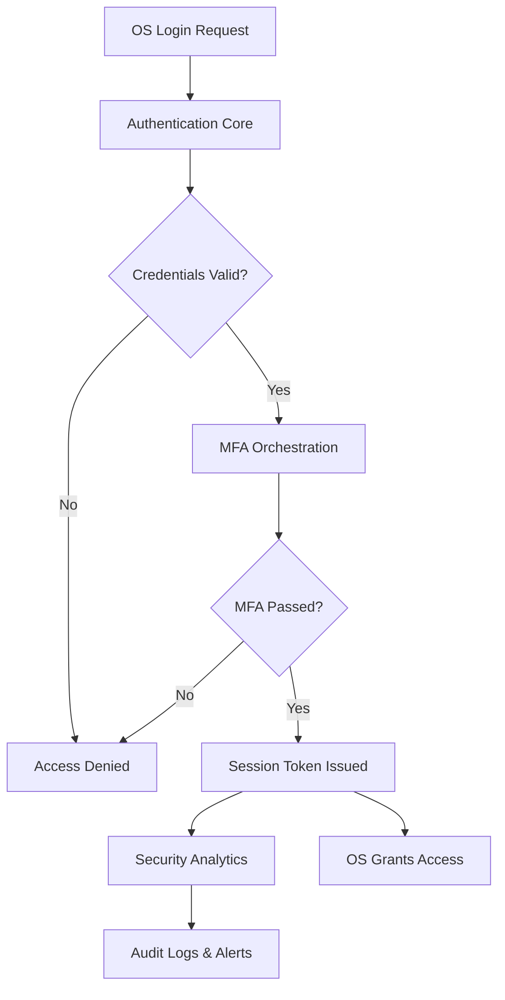

# Secure OS Authentication Module

## Project Overview
The Secure OS Authentication Module strengthens operating system login flows by layering multi-factor authentication (MFA), memory-safe credential validation, and comprehensive auditing. The expected outcome is a pluggable package that integrates with Linux PAM, Windows Credential Providers, and macOS authentication services to enforce MFA, thwart buffer overflow exploitation, and eliminate trapdoor-style backdoors. The scope covers authentication pipelines, MFA orchestration, analytics-driven administration, and deployment guidance, while assuming existing directory services (e.g., Active Directory, LDAP) provide identity data.

## Module-Wise Breakdown
1. **Authentication Core Module** – Validates user credentials, enforces contextual policies, issues signed session tokens, and exposes integration hooks for OS-specific login managers.
2. **MFA Orchestration & UX Module** – Coordinates second-factor challenges (TOTP, WebAuthn, hardware tokens), delivers CLI/GUI prompts, and manages fallback or recovery paths.
3. **Security Analytics & Administration Module** – Aggregates audit logs, detects anomalies via SIEM integrations, and offers configuration tooling for policy management and compliance reporting.

## Functionalities
### Authentication Core Module
- **Credential Hardening:** Uses Argon2id or PBKDF2 for password verification, salted secrets, and secure memory handling.
- **Contextual Policy Engine:** Applies rules based on device posture, geolocation, or time to determine MFA requirements.
- **Session Token Service:** Issues signed, time-bound tokens with revocation support and tamper checks.
- **Memory Safety Controls:** Implements components in Rust or Go, leveraging ASLR and stack canaries to mitigate buffer overflow attempts.

### MFA Orchestration & UX Module
- **Multi-Factor Catalog:** Supports TOTP (RFC 6238), FIDO2/WebAuthn authenticators, push notifications, and smartcards.
- **Adaptive UX:** Presents native dialogs (GTK, WPF, SwiftUI) or CLI prompts, with accessibility features like screen-reader labels.
- **Fallback & Recovery:** Provides backup codes, delegated approvals, and supervised account recovery workflows.
- **Secure Communication:** Utilizes TLS 1.2+ with certificate pinning for out-of-band factor validation services.

### Security Analytics & Administration Module
- **Audit Logging:** Captures granular authentication events with tamper-evident storage and secure log forwarding.
- **Anomaly Detection Hooks:** Streams telemetry to SIEM/SOAR platforms and optional ML models for risk scoring.
- **Policy Management:** Offers REST/GraphQL APIs and admin UI/CLI for MFA policy, rate limiting, and IP allowlists.
- **Compliance Reporting:** Generates exportable reports (NIST 800-63B, ISO 27001) and automated alerts.

## Technology Used
- **Programming Languages:** Rust or Go for core authentication services; Python or TypeScript for admin tooling and analytics connectors; limited C/C++ adapters for OS-specific APIs.
- **Libraries and Tools:** libsodium or RustCrypto for cryptography, OATH Toolkit for TOTP, webauthn-rs/Yubico SDK for FIDO2, HashiCorp Vault or OS keychains for secret storage, OpenTelemetry for observability, Elastic Stack/Splunk SDK for analytics.
- **Other Tools:** GitHub for version control, GitHub Actions for CI/CD, Docker for integration testing environments, AFL/libFuzzer for fuzz testing, and SAST tools (Clippy, go vet).

## Flow Diagram

## Execution Plan
1. **Requirements & Threat Modeling:** Capture OS integration points, compliance mandates, and STRIDE/LINDDUN threat models.
2. **Architectural Design:** Define module boundaries, data flows, and API contracts; document decisions via ADRs and sequence diagrams.
3. **Authentication Core Implementation:** Build credential validation, secure storage adapters, and token services with automated testing and fuzzing.
4. **MFA Module Development:** Implement pluggable factor providers, native UX prompts, and fallback processes; ensure TLS-pinned communications.
5. **Analytics & Administration Buildout:** Develop logging pipelines, admin interfaces, SIEM integrations, and compliance reporting utilities.
6. **Security Hardening & Testing:** Apply static/dynamic analysis, penetration testing, buffer overflow assessments, and continuous regression testing.
7. **Deployment & Integration Validation:** Package installers (DEB/RPM/MSI), perform pilot deployments, monitor telemetry, and validate rollback procedures.
8. **Documentation & Training:** Publish integration guides, admin/user manuals, and incident response runbooks; deliver training sessions.
9. **Continuous Monitoring & Improvement:** Establish feedback loops, bug bounty programs, and scheduled security reviews to iterate on features.

## Revision Tracking on GitHub
- **Repository Name:** `OS-Project-`
- **GitHub Link:** _Pending publication; replace with hosted repository URL when available._
- **Branch Strategy:** Adopt trunk-based development with protected main branch, peer reviews, and semantic versioning for releases.
- **Issue & PR Templates:** Utilize GitHub issue templates for feature requests/bugs and pull request templates for consistent reviews.

## Conclusion and Future Scope
The Secure OS Authentication Module delivers a resilient, multi-factor authentication framework that integrates seamlessly with major operating systems while defending against buffer overflow exploits and trapdoor vulnerabilities. Future enhancements include risk-based adaptive authentication, deeper hardware security module integration, AI-driven anomaly detection, and expanded policy automation for zero-trust environments.

## References
1. NIST Special Publication 800-63B: Digital Identity Guidelines.
2. FIDO Alliance. "FIDO2: Moving the World Beyond Passwords."
3. OWASP Authentication Cheat Sheet.
4. Microsoft Docs. "Windows Credential Provider Framework."
5. Pluggable Authentication Modules (PAM) Application Developer's Guide.
